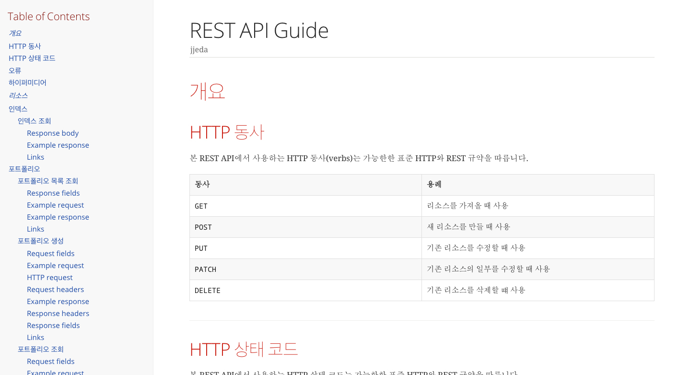
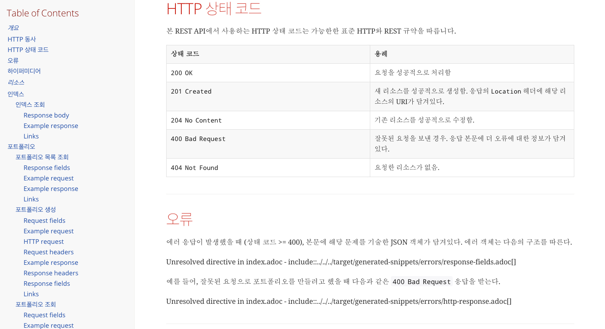
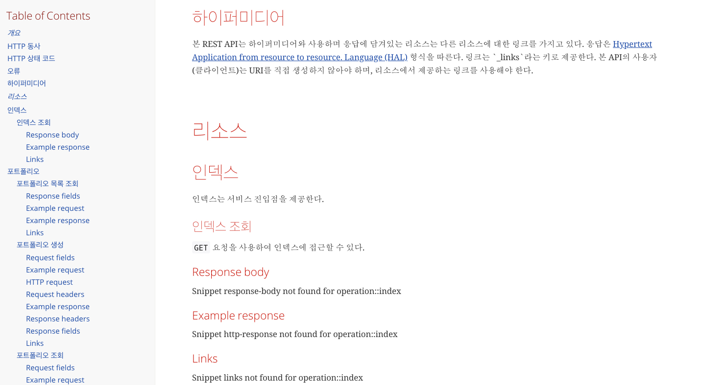
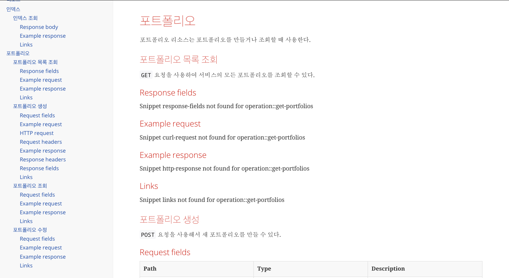
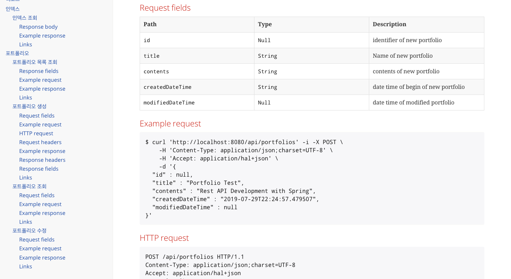
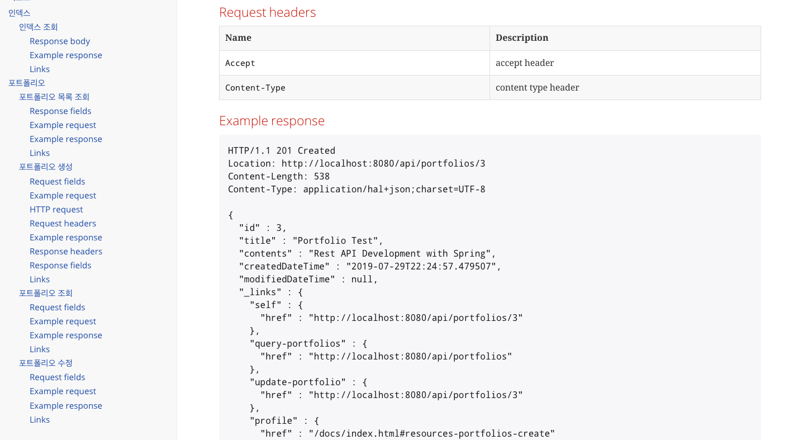
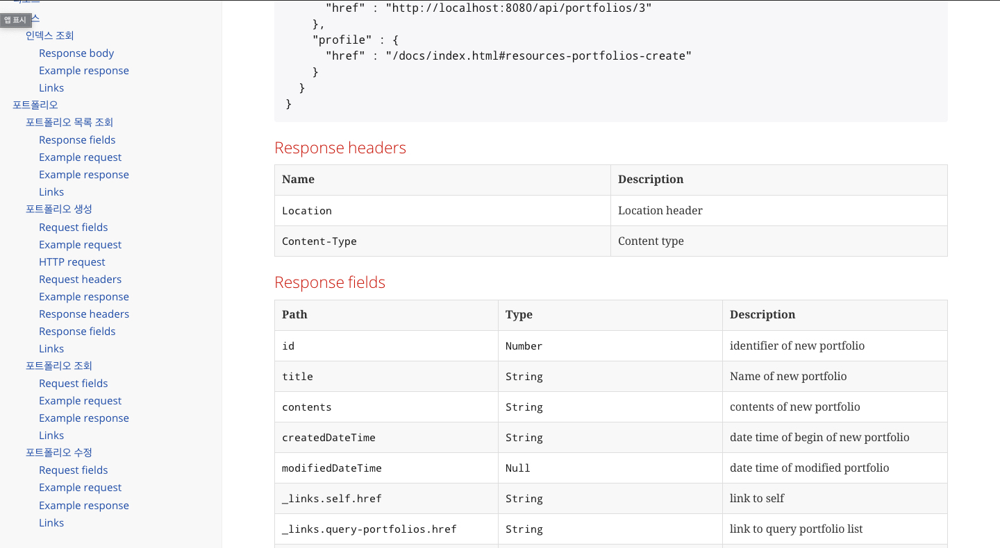
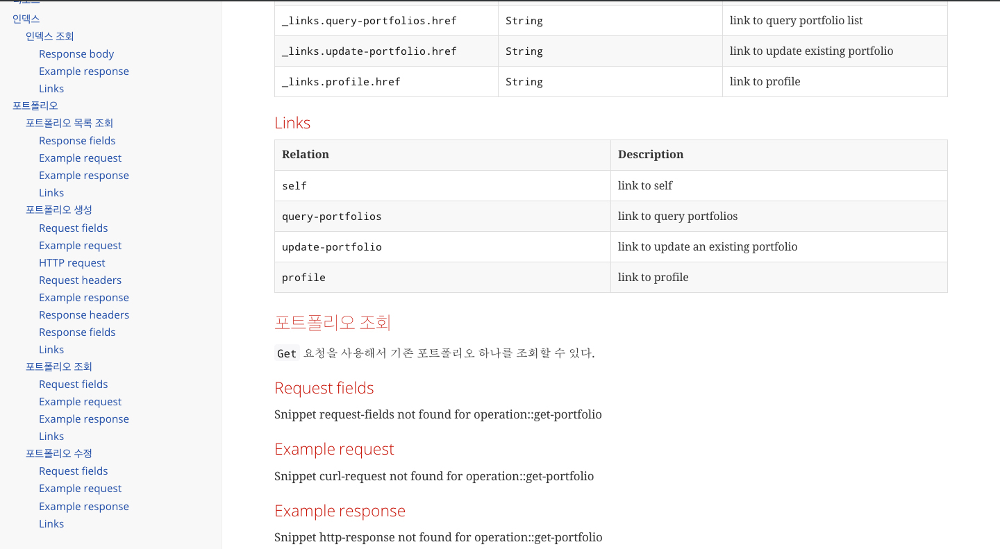
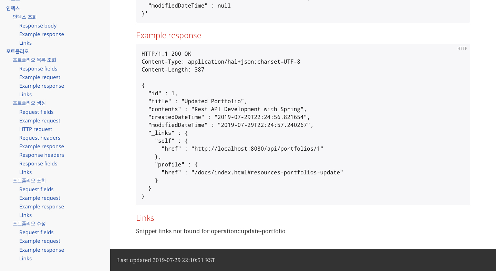

## 0. 아키텍쳐

## 1. 기술 스택

- Spring security(OAuth2) : 인증, 권한, 인가
  - 초기 Grant Type : password , TokenStore : Inmemmory(h2)
  - 확장 Grant Type : Authorization Code, TokenStore : JDBC -> Redis 
- Spring Boot
- Spring MVC
- Spring data JPA : ORM
- Spring HATEOAS : RESTful
- Spring REST Docs : RESTful

## 2. 패러다임

- TDD[(테스트코드 보기)](/src/test/java/me/jjeda/houseserver/portfolios/PortfolioControllerTest.java)
  - Unit Test
  - Slicing Test
  - Application Test
- REST[(Docs 바로가기)](/static/docs/index.html) //TODO : 배포
  - Self-descriptive
  - HATEOAS
- MSA // TODO
  - 까지 할 수 있을까..
  - Docker
  - AWS or GCP
  - API Gateway
  - Jenkins

## 3. DOCS

